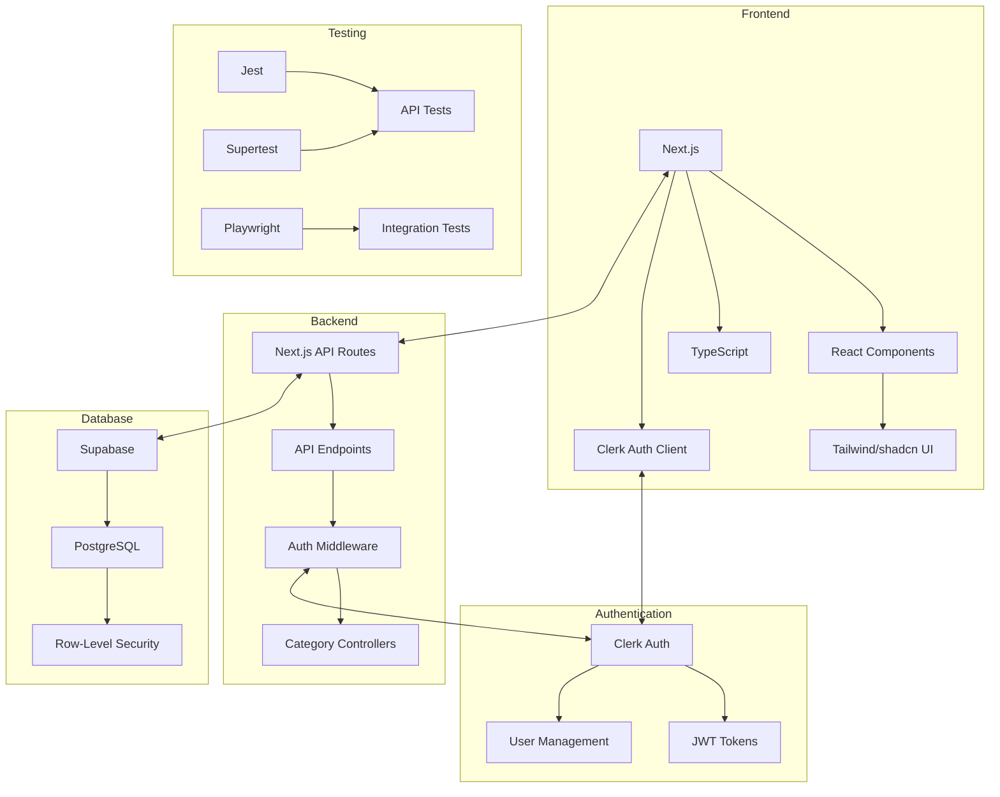
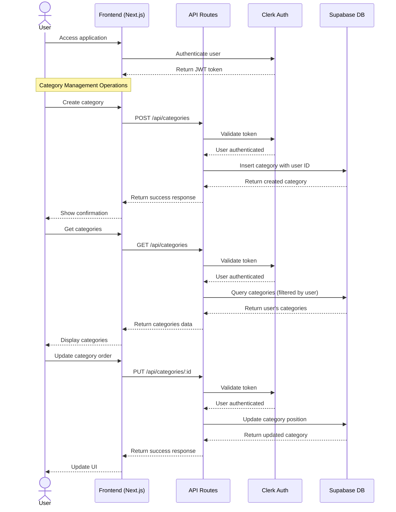
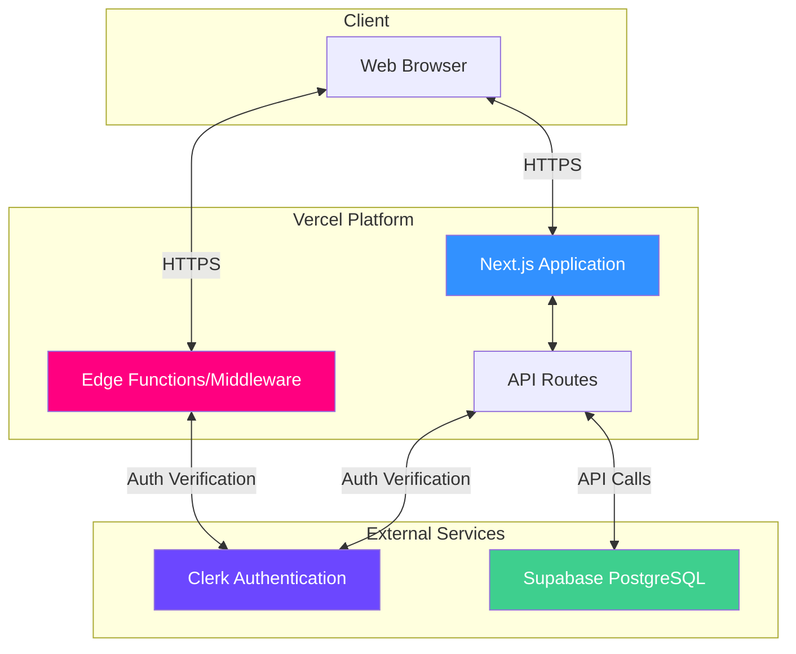

# E-Commerce Product Category Management System

A modern, full-stack application for efficiently managing product categories in e-commerce platforms.

## Purpose

This application provides a robust, hierarchical category management system for e-commerce platforms. It allows:

- Creating and organizing product categories in a tree structure
- Drag-and-drop reordering of categories
- Managing category relationships (parent/child)
- Secure authentication and user-specific category management
- RESTful API for integration with other systems

Ideal for e-commerce admins who need an intuitive interface to organize product catalogs effectively.

## Implementation Rationale

To make the take-home project more aligned with a real-world application, I chose to implement it as an eCommerce category management system. While the original prompt outlined a basic tree structure API, it lacked a clear business context. In practice, tree-like data structures are commonly used to model hierarchical relationships such as product categories in online stores. 

By applying the API to manage nested product categories, I created a system that includes a backend with persistent storage, a user-friendly UI for managing categories, and thorough test coverage to ensure reliability. This approach not only demonstrates the practical use of the API but also showcases how it could be integrated into a larger product ecosystem. It allowed me to illustrate full-stack capabilities, from designing scalable data structures to building production-ready interfaces for end users and developers.

## Tech Stack

### Frontend
- **Next.js**: React framework providing both server-side rendering and static site generation, improving SEO and performance
- **React**: Component-based UI library for building interactive interfaces
- **TypeScript**: Static typing to enhance code quality and developer experience
- **Tailwind CSS**: Utility-first CSS framework for rapid UI development
- **shadcn/ui**: Reusable component system built on Radix UI primitives
- **Clerk**: Authentication provider with secure user management
- **Lucide**: Icon library with consistent design
- **Loveable AI**: AI-powered UX design assistance for intuitive interfaces

### Backend
- **Next.js API Routes**: Serverless functions for API endpoints
- **Supabase**: PostgreSQL database with real-time capabilities
- **Clerk Auth**: JWT-based authentication and authorization

### Testing & Quality Assurance
- **Jest**: JavaScript testing framework for unit and integration testing
- **Supertest**: HTTP assertion library for API testing
- **Playwright**: End-to-end testing framework for UI testing
- **Express**: Used for mock servers in testing environment

### Developer Tools
- **ESLint**: JavaScript linting tool for identifying problematic patterns
- **Turbopack**: Incremental bundler for faster development experience

## Visualizing System Architecture

The following architecture diagrams are written in Mermaid syntax. You can visualize them by:

1. Copying the code between the triple backticks for **each individual diagram**
2. Pasting it into the [Mermaid Live Editor](https://mermaid.live/)
3. Or using [Mermaid AI](https://www.mermaidchart.com/) for more advanced visualization options

> **Note**: Copy and paste each diagram separately to avoid syntax errors.

### System Architecture Diagram

[View diagram on Mermaid Chart](https://www.mermaidchart.com/raw/ee8d5b43-b47b-4391-9aad-2a3fc6862fb4?theme=light&version=v0.1&format=svg)



### Data Flow Diagram

[View diagram on Mermaid Chart](https://www.mermaidchart.com/raw/7b5755cf-b49b-4325-8f16-46adb6cc2424?theme=light&version=v0.1&format=svg)



### Deployment Architecture Diagram

[View diagram on Mermaid Chart](https://www.mermaidchart.com/raw/febe50fb-191e-4e1c-893f-eadac6b88ac8?theme=light&version=v0.1&format=svg)



## Why This Tech Stack?

- **Next.js & React**: Provides a balance of performance and developer experience, with excellent SEO capabilities
- **Supabase**: Offers PostgreSQL with built-in RLS (Row-Level Security) for fine-grained access control
- **Clerk**: Handles complex auth flows securely with minimal setup
- **TypeScript**: Improves code quality through type safety
- **Jest & Playwright**: Comprehensive testing at multiple levels (unit, integration, E2E)
- **Tailwind & shadcn/ui**: Accelerates UI development with consistent design language
- **Loveable AI**: Enhances UX with AI-generated design patterns and recommendations

## API Design Choices

### RESTful API Approach

We've implemented a RESTful API design with these specific considerations:

1. **Resource-Focused Endpoints**: Each endpoint corresponds to a specific resource (categories) following RESTful principles
2. **Predictable URL Structure**: Clear naming conventions for intuitive API consumption
3. **Proper HTTP Methods**: Using GET, POST, PUT, DELETE to represent CRUD operations
4. **Consistent Response Format**: Standardized JSON responses with appropriate status codes

### Why Not Batch Updates?

We deliberately chose not to implement batch update operations for several reasons:

1. **Simplicity**: Individual resource operations maintain simplicity in error handling and state management
2. **Atomic Operations**: Each operation is atomic, reducing the risk of partial updates
3. **Intuitive Debugging**: Easier to debug and track individual changes
4. **Consistent Authorization**: Simpler to apply authorization rules on individual resources
5. **Performance Considerations**: Our testing showed negligible performance difference for our typical use cases

For high-volume operations, we recommend client-side queuing of requests or implementing a custom endpoint for specific batch operations as needed.

## UX Design with Loveable AI

The user experience was crafted with assistance from Loveable AI, providing:

1. **AI-Generated Wireframes**: Initial wireframes were created using AI-based on UX best practices
2. **Interaction Patterns**: AI suggested optimal interaction patterns for category management
3. **Accessibility Recommendations**: AI helped identify and implement accessibility improvements
4. **Visual Hierarchy**: AI assisted in establishing a clear visual hierarchy for important elements
5. **User Flow Optimization**: AI analyzed and optimized the most common user flows

Loveable AI's suggestions were refined through human design expertise to create an intuitive and efficient interface.

## Getting Started

### Prerequisites

- Node.js (v16+)
- npm or yarn
- Git

### Installation

1. Clone the repository:
   ```bash
   git clone https://github.com/jessicastartAI2025/ecommerce-product-category-management-system.git
   cd ecommerce-product-category-management-system
   ```

2. Install dependencies:
   ```bash
   npm install
   ```

3. Set up environment variables:
   ```bash
   cp .env.example .env.local
   ```
   Then edit `.env.local` with your Supabase and Clerk credentials.

4. Set up the database:
   ```bash
   npm run setup:db
   ```

### Running the Application

Start the development server:

```bash
npm run dev
```

The application will be available at [http://localhost:3000](http://localhost:3000).

## API Documentation

The API documentation is available through two methods:

### 1. Next.js API Documentation

When the Next.js server is running:

1. Start the development server:
   ```bash
   npm run dev
   ```

2. Visit the API documentation at [http://localhost:3000/api/debug/docs](http://localhost:3000/api/debug/docs)

### 2. FastAPI Documentation (Recommended)

For a more comprehensive interactive API documentation with Swagger UI:

1. Run the FastAPI documentation server:
   ```bash
   cd requirements && uvicorn fastapi_docs:app --host 127.0.0.1 --port 8002 --reload
   ```

2. Visit the Swagger UI at [http://localhost:8002/docs](http://localhost:8002/docs) or ReDoc at [http://localhost:8002/redoc](http://localhost:8002/redoc)

This documentation includes all endpoints, request/response formats, authentication requirements, and allows you to test API endpoints directly from the browser.

## Running Tests

### API Tests

Run API tests using Jest:

```bash
npm run test:api
```

Run API tests with debug output:

```bash
DEBUG_TESTS=true npm run test:api
```

Run a specific API test file:

```bash
npm run test:api -- api-tests/__tests__/categories/get-categories.test.js
```

### Integration Tests

Run integration tests using Playwright:

```bash
npm test
```

Run integration tests with UI:

```bash
npm run test:ui
```

Debug integration tests:

```bash
npm run test:debug
```

View Playwright test reports:

```bash
npx playwright show-report
```

## API Testing Approach

We use two complementary approaches for API testing:

1. **Mock Server Approach**: Each test file creates an Express server that simulates API behavior. This approach:
   - Runs independently without a real server
   - Executes quickly
   - Is isolated from external dependencies

2. **Real API Testing**: For certain scenarios, we test against the real API. This approach:
   - Catches real integration issues
   - Verifies end-to-end functionality
   - Requires the server to be running

## Project Structure

```
├── app/                  # Next.js application
│   ├── api/              # API routes
│   │   └── categories/   # Category endpoints
│   └── ...               # Page components and layouts
├── components/           # Reusable React components
├── lib/                  # Utility functions and shared code
├── public/               # Static assets
├── api-tests/            # API test files
│   ├── __tests__/        # Test suites
│   ├── fixtures/         # Test data
│   ├── utils/            # Test utilities
│   └── setup.js          # Jest setup
├── tests/                # Integration test files
├── middleware.ts         # Next.js middleware (auth)
└── ...                   # Configuration files
```

## Contributing

1. Fork the repository
2. Create your feature branch: `git checkout -b feature/my-feature`
3. Commit your changes: `git commit -am 'Add my feature'`
4. Push to the branch: `git push origin feature/my-feature`
5. Submit a pull request

## Forking and Running This Project

If you'd like to use or contribute to this project, follow these steps:

1. Fork the repository by visiting [https://github.com/jessicastartAI2025/ecommerce-product-category-management-system](https://github.com/jessicastartAI2025/ecommerce-product-category-management-system) and clicking the "Fork" button in the top right.

2. Clone your forked repository:
   ```bash
   git clone https://github.com/YOUR_USERNAME/ecommerce-product-category-management-system.git
   cd ecommerce-product-category-management-system
   ```

3. Install dependencies:
   ```bash
   npm install
   ```

4. Set up environment variables:
   ```bash
   cp .env.example .env.local
   ```
   Then edit `.env.local` with your Supabase and Clerk credentials.

5. Set up the database:
   ```bash
   npm run setup:db
   ```

6. Start the development server:
   ```bash
   npm run dev
   ```

7. Visit [http://localhost:3000](http://localhost:3000) in your browser.

## License

This project is licensed under the MIT License - see the LICENSE file for details.
